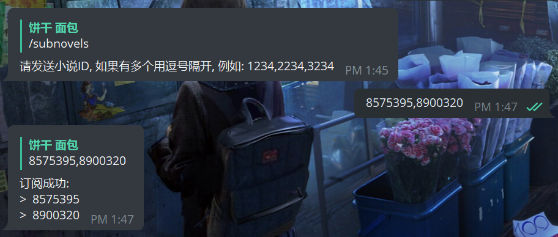
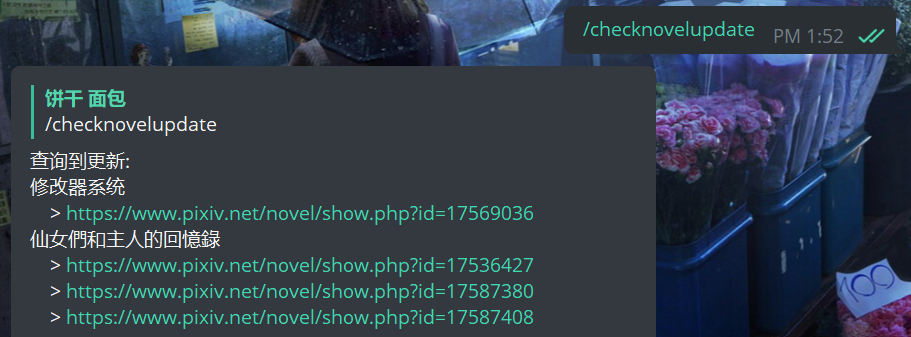

# pixiv-tg-bot

🤖 关于方便 Pixiv 上看小说的 Telegram Bot

<div >
    
    
</div>

## 部署

### 机器人设置

```txt
# 设置机器人命令
/setcommands

start - 快速开始
help - 查看帮助信息
subnovels - 订阅小说
showsubnovels - 查看已经订阅的小说
checknovelupdate - 查看订阅的小说是否更新
removesubnovels - 移除订阅的小说
```

### 运行

```shell
pixiv-tg-bot -t [机器人token]

# 通过代理运行
pixiv-tg-bot -t [机器人token] -p [host:port]

# 指定数据库
pixiv-tg-bot -t [机器人token] -p [host:port] -d [数据路径]
```
