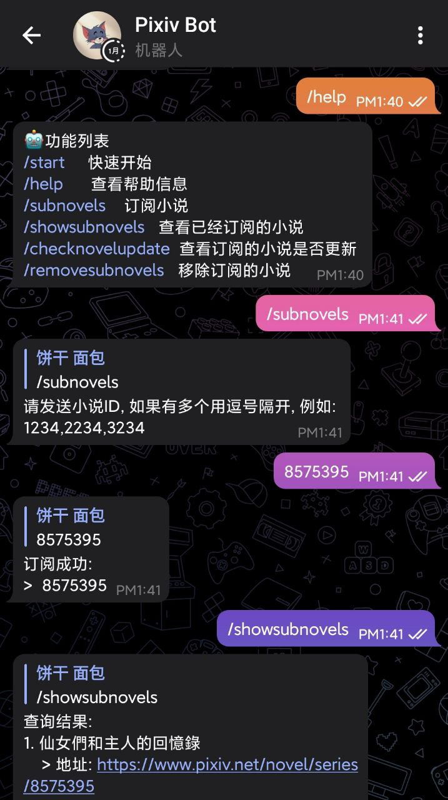
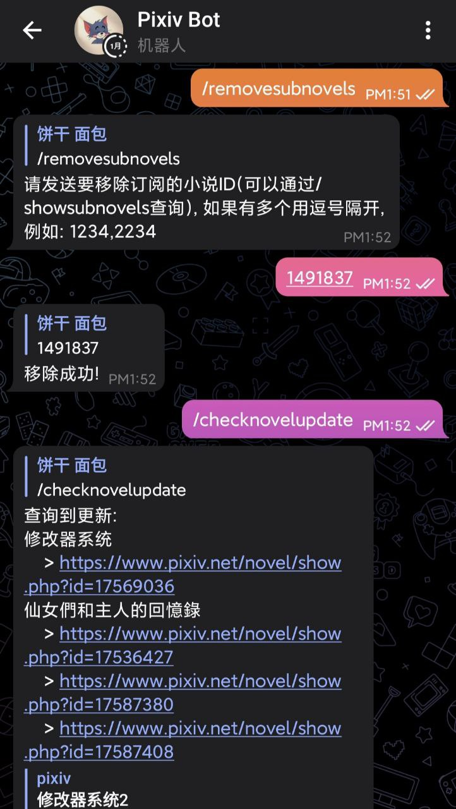

# pixiv-tg-bot

🤖 关于 pixiv 的 Telegram Bot

    
    

## 部署

### 机器人设置

/setcommands

start - 快速开始 
help - 查看帮助信息 
subnovels - 订阅小说 
showsubnovels - 查看已经订阅的小说 
checknovelupdate - 查看订阅的小说是否更新 
removesubnovels - 移除订阅的小说 

